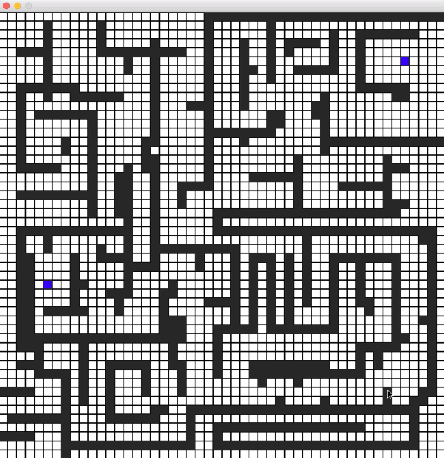
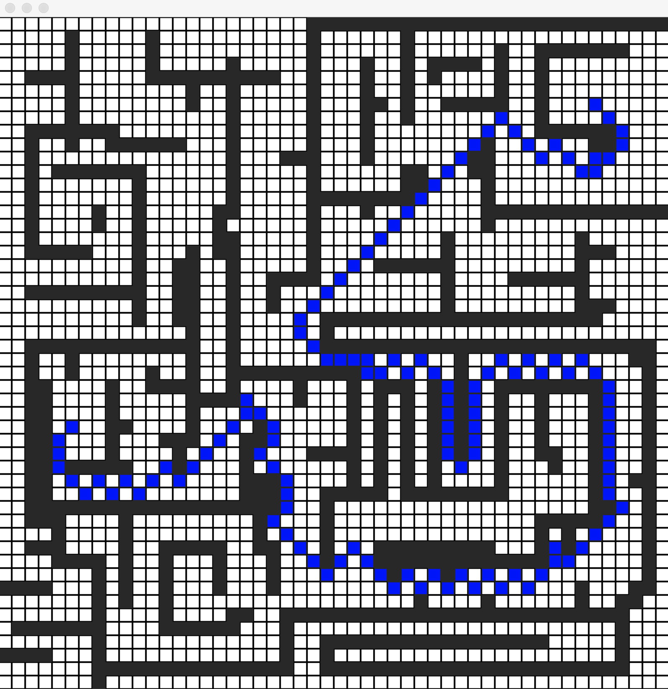

# A* Path Finding Visualisation
 
Written in Python 3.7 using Pygame.

<kbd>

  
</kbd>
<br>

To run the game, use the following command:
```
pip install pygame
python main.py
```

## Instructions
1. Select **start node** by holding the **'S'** key and left mouse button on the grid
2. Select **end node** by pressing the **'E'** key and left mouse button on the grid
3. Press **'Space'** to run the algorithm

## Special Feature
1. Press **'P'** to print map. Returns a map array. 
2. Press **'L'** to load map. By default, it will load `map_1.py`


## References
- [A* Pathfinding - Algorithm Explanation by Sebastian Lague](https://www.youtube.com/watch?v=-L-WgKMFuhE&t=463s)
